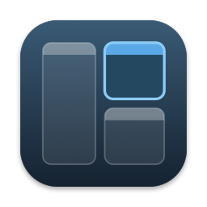

<p align="center"></p>

# mac-i3

**[github.com/u8sand/mac-i3](https://github.com/u8sand/mac-i3)** · [Releases](https://github.com/u8sand/mac-i3/releases) · GPL-3.0-or-later

i3 window management for macOS, as a single CLI. Run `mac-i3`, and it listens for key bindings (Option-based by default) and tiles, focuses and moves your windows the way i3 does.

It implements i3's real container tree (arbitrary nesting, per-container layouts, `focus parent`, focus stacks, `split`, tabbed/stacked with title bars, floating, fullscreen, workspaces, multiple outputs), rather than a simplified grid. Configuration management is a subset of the i3wm config.

I tried to like [AeroSpace](https://github.com/nikitabobko/AeroSpace) which is definitely more mature than this, but it just didn't work like the [i3wm](https://i3wm.org/) I'm used to on linux. I vibe-coded this project in an afternoon with [Claude Code](https://claude.com/product/claude-code) focusing on the features of i3wm I actually use and making it integrate on mac. I'm liking how it works way better, hope anyone else looking for something similar finds it useful.

## Screenshot


## Install (the app)

1. Download `mac-i3-<version>.dmg` (or the `.zip`) from the [Releases page](https://github.com/u8sand/mac-i3/releases), open it and drag
   **mac-i3** onto **Applications**.
2. Open it from Applications. The build is **not notarized** (that needs a paid Apple Developer account), so macOS
   says it cannot verify the app the first time: right-click **mac-i3** > **Open** > **Open**, once. Or, in Terminal:
   `xattr -dr com.apple.quarantine /Applications/mac-i3.app`.
3. It explains what it needs, then asks for two permissions in **System Settings > Privacy & Security**:
   **Accessibility** (to move and focus windows) and **Input Monitoring** (to see your key bindings). Turn on
   **mac-i3** in both lists; it starts by itself as soon as you do. (The permissions belong to the app, not to your
   terminal. Quit AeroSpace / yabai first, since two window managers will fight.)

mac-i3 lives in the **menu bar** (no Dock icon): the workspace list, or a small tiling glyph if you set
`workspace_bar no`. Right-click it (or click the glyph) for **Reload Config**, **Edit Config…**, **Open Log**,
**Launch at Login**, **About** and **Quit**. Your configuration is `~/.config/mac-i3/config` (Edit Config creates it
from the built-in default the first time); warnings and config errors go to `~/Library/Logs/mac-i3.log`.

* **Command line:** the app contains the CLI. To use `mac-i3 msg …` and friends from a terminal:
  `sudo ln -s /Applications/mac-i3.app/Contents/MacOS/mac-i3 /usr/local/bin/mac-i3`.
* **Updating:** quit mac-i3, replace the app in Applications, open it. Because the build is ad-hoc signed, macOS ties
  the permissions to that exact build, so after an update you may have to switch mac-i3 off and on again (or remove it
  with `-` and re-add it) in the two Privacy lists. A build signed with a Developer ID keeps them.
* **Uninstall:** choose Quit, delete `/Applications/mac-i3.app`, and optionally `~/.config/mac-i3`; remove mac-i3 from
  the Privacy lists and Login Items in System Settings.

### Building the app yourself

```sh
scripts/package.sh          # -> dist/mac-i3.app, dist/mac-i3-<version>.dmg, dist/mac-i3-<version>.zip, SHA256SUMS
```

It builds arm64 and x86_64 separately and merges them with `lipo` (SwiftPM's own universal build needs Xcode), renders
the icon from code (`mac-i3 render-icon`), writes `Info.plist` from `packaging/Info.plist.in` (version from the `VERSION`
file, bundle id `io.github.u8sand.mac-i3`) and signs the bundle. Knobs: `BUNDLE_ID`, `VERSION`, `BUILD`, `ARCHS`. For a
build that opens everywhere with no warning, sign with a Developer ID and notarize (needs an Apple Developer account and
a `notarytool store-credentials` profile):

```sh
SIGN_IDENTITY="Developer ID Application: Your Name (TEAMID)" NOTARY_PROFILE=mac-i3 scripts/package.sh
```

## Build from source & run

```sh
git clone https://github.com/u8sand/mac-i3 && cd mac-i3
swift build -c release          # binary: .build/release/mac-i3
.build/release/mac-i3 doctor    # check permissions
.build/release/mac-i3           # run (foreground); Ctrl-C restores parked windows
```

**Permissions** when run from a terminal (System Settings → Privacy & Security): grant **Accessibility** and
**Input Monitoring** to the app that launches `mac-i3` (Terminal, iTerm, VS Code...). Quit AeroSpace/yabai first —
two window managers will fight.

### Trying it safely

`mac-i3 --only Terminal` manages **only** the named apps (name or bundle id, repeatable). Everything
else on your desktop is left alone.

```sh
mac-i3 --only Terminal -v       # then press Option+T a few times
mac-i3 test-window A            # a labelled window that is handy for experiments
```

If a run ever ends badly (e.g. `kill -9`), `mac-i3 restore` pulls parked windows back on-screen; a new
daemon also does this on start.

## Key bindings

The built-in default (used when there is no `~/.config/mac-i3/config`; print it with `mac-i3 default-config`):

| Keys | Action |
|---|---|
| `Option+T` / `C` / `W` | new Terminal / VS Code / Chrome window |
| `Option+Q` | close the focused window |
| `Option+Z` | toggle floating |
| `Option+←↓↑→` | focus left / down / up / right |
| `Option+Shift+←↓↑→` | move the window left / down / up / right |
| `Option+1..0` | switch to workspace 1..10 |
| `Option+Shift+1..0` | move the window to workspace 1..10 |
| `Control+Option+Enter` | fullscreen |
| `Control+Option+↓` / `→` | split vertically / horizontally (where the *next* window opens) |
| `Control+Option+Tab` | tabbed layout |
| `Control+Option+↑` / `←` | toggle split direction |
| `Control+Option+C` / `R` / `E` | reload config / restart / exit |

Workspaces alternate between the first two displays (odd on the primary, even on the next), and there is a
10px gap between windows. Everything is remappable, and the default file lists more bindings you can switch on
(home-row focus `j k l ;`, stacked layout, `focus parent`, keyboard resize mode, moving a workspace to another
display). `mac-i3 default-config stock` prints i3's own stock bindings (`$mod+j/k/l/;`, `$mod+r` resize mode,
`$mod+d`...) if you would rather start from those.

Windows open next to the focused one; `split` decides the direction of the *next* window, exactly as
in i3. Clicking a tab in a title bar focuses that window; clicking a window focuses it in the tree.

### Mouse

* **Mouse follows focus.** When you move focus with a key or `mac-i3 msg` (focus, move, workspace switch, closing
  a window), the cursor jumps to the middle of the newly focused window, unless it is already over it. Clicks,
  tab clicks, drops and windows that open by themselves never move your cursor. `mouse_warping` picks the
  behaviour: `window` (default), `center` (always to the exact centre), `output` (only when focus changes display,
  i3's own behaviour) or `none`.

* **Click** a window: it becomes the focused window, so the focus keys continue from it.
* **Drag a window edge or corner** (tiled windows): the boundary moves and the neighbours reflow. An edge on
  the outer border of the screen cannot move; the window snaps back.
* **Drag a window by its title bar** and drop it on another window; a translucent preview shows where it will go:
  * on the **outer quarter of an edge**: it goes beside that window on that side (splitting the slot if the
    layout runs the other way),
  * in the **middle**: it joins that window's **group**, inserted right after it in the same container. In a
    tabbed or stacked container it becomes a tab / row, and dropping on the tab bar itself does the same
    (`mouse_drop_center swap` makes the middle swap the two windows instead),
  * on **another display**: it joins the window under the cursor there, or that display's workspace if it is empty,
  * dropped on its own slot, a floating window, or nothing: it snaps back.
* **Floating windows** are moved and resized freely and never affect the tiled layout.

Whether a drag moves or resizes is decided by *where you grabbed* (title bar/content vs. border), never by
the size afterwards, because macOS resizes a window that no longer fits when you drop it on a smaller display.
`mouse_gestures no` in the config turns all of this off. Turn off macOS's own *Tile by dragging windows to screen
edges* (System Settings → Desktop & Dock → Windows) so it does not compete with drop-to-move.

## Configuration

`~/.config/mac-i3/config` uses i3 syntax (`mac-i3 default-config` prints the built-in one):
`set`, `bindsym` (incl. `--release`), `mode "name" { ... }`, `exec`, `gaps inner|outer N`,
`focus_wrapping`, `workspace_bar yes|no`, `workspace_bar_icons all|active|none`, `workspace_bar_layout tree|flat`, `mouse_warping window|center|output|none`, `mouse_gestures yes|no`, `mouse_drop_center group|swap`, `workspace N output M`, `for_window`, `assign` (see below).
Keys are physical (layout independent).

### Window rules

`for_window [criteria] <command>` runs an i3 command on every new window; `assign [criteria] → <workspace>`
sends it to a workspace. Criteria values are **regular expressions matched anywhere** in the property
(case-insensitive here; anchor with `^…$` for an exact match). `class`, `instance`, `app` and `app_name`
all mean the application's name; `title` is the window title; several terms must all match; `[]` matches
everything. Rules run in file order, so a later rule can undo an earlier one.

```
# float everything by default (windows keep the position and size the app gave them)...
for_window [class=".*"] floating enable
# ...except these, which tile
for_window [app="^(Terminal|iTerm2)$"] floating disable
```

With this, `Option+Z` floats or tiles the focused window on demand. Note that
`focus left/right/up/down` only navigates between *tiled* windows; floating windows are reached with the
mouse or `focus mode_toggle` (not bound by default; the default config has it ready to uncomment), and
`move <dir>` nudges them by 10px.

### Workspace bar

A menu bar item lists your workspaces, so you can always see where you are:

```
 1 ▣▣   2 ▣   ⟦3 ▣▣▣⟧ ┃ 4 ▣   ⟦5 ▣⟧        resize
```

* Workspaces are grouped **by display** (in `output N` order, primary first, separated by a divider).
* The workspace **showing** on each display has a soft highlight; the one with **keyboard focus** is filled
  with the accent colour.
* Each workspace shows its **window layout in i3 style**: a container is its layout letter (`h` horizontal,
  `v` vertical, `t` tabbed, `s` stacked) followed by its children in square brackets, and each window is its
  app icon. Chrome and a terminal side by side, next to a tabbed pair whose second tab is split vertically, reads
  `h[chrome term] t[chrome v[chrome chrome]]` (drawn with the real app icons in place of the names). The
  workspace's own container is left implicit while it is plain horizontal, and shows as `t[…]`, `v[…]` or `s[…]`
  otherwise; floating windows form an `f[…]` group, and the window with keyboard focus is underlined.
* When the item would get too wide for the menu bar it degrades step by step: the tree stays only on the showing
  workspaces, then those fall back to one icon per app, and finally to numbers only, so it never crowds out your
  other menu bar items. (`workspace_bar_layout flat` skips the tree and shows just app icons.)
* Only workspaces that exist are listed (they have windows or are showing), sorted numerically.
* The current binding mode (e.g. `resize`) appears as an orange tag while it is active.
* **Click** a workspace to switch to it. **Right-click** (or ctrl-click) for a menu of every window, grouped by
  workspace; choosing one focuses it. Clicking the bar never moves the mouse cursor.

```
workspace_bar yes|no                 # default yes
workspace_bar_icons all|active|none  # default all: detail everywhere (dropped when crowded); active: only on showing workspaces
workspace_bar_layout tree|flat       # default tree: h[icon icon] structure; flat: just the app icons
```

`mac-i3 bar-preview out.png [dark] [flat] [crowded]` renders a sample bar offscreen (no daemon needed), and `mac-i3 bar` prints what the bar shows (including each workspace's layout as text, with app names) and where it is on screen, and `mac-i3 doctor` warns if macOS is hiding
it. **macOS only draws the menu bar on the primary display** while displays share a Space (the default), so the
bar lists all displays' workspaces in one place. On a Mac with a notch a crowded menu bar can hide the item
behind the notch: Cmd-drag other items out of the way, or use `workspace_bar_icons none`. You can also Cmd-drag
the bar item itself to where you want it; macOS remembers.

### Workspaces and displays

`mac-i3 outputs` numbers your displays: **output 1 is the primary display** (the one with the menu bar),
then output 2, 3... are the others from left to right.

```
$ mac-i3 outputs
1	display-1	Built-in Retina Display	1800x1130+0+39	primary
2	display-2	ARZOPA	1920x1080+1800+0
```

Pin workspaces to displays in the config:

```
workspace 1 output 1
workspace 2 output 2
workspace 3 output 2 1      # first connected one wins
```

* A workspace whose output is **not connected** lives on the **primary** display, and moves (and shows) on
  its own display when that is plugged in. Unplugging a display folds its workspaces into the others.
* Assigned workspaces are created on their display, so `Option+2` jumps to the display that owns workspace 2.
* Assignments are re-applied on `reload` and whenever displays change.
* A display can also be named by its id (`display-2`), its product name (`ARZOPA`, quoted if it has
  spaces) or a part of the product name that is unique (`set $tv "LG"` then `workspace 5 output $tv`).

To move a workspace by hand (does not change the assignment; the next reload puts it back):

```
move workspace to output right        # or left/up/down, a number (2), or a name
move workspace to output 2
focus output 1
```

Bind them if you use them a lot, e.g. `bindsym Control+$super+o move workspace to output right`. Explicit
commands are strict: `move workspace to output 2` with one display is an error, not a move to the primary.

### Modifier keys

i3 names its modifiers after X11's modifier slots. On a Mac they map like this (names are
case-insensitive):

| Name in config | i3 (X11) meaning | On macOS |
|---|---|---|
| `Mod1`, `Alt`, `Option` | Alt | **Option** |
| `Mod4`, `Super`, `Win`, `Cmd`, `Command` | Super / Windows key | **Command** |
| `Shift` | Shift | **Shift** |
| `Control`, `Ctrl` | Control | **Control** |
| `Mod2` | NumLock | not supported |
| `Mod3` | usually unused (sometimes Hyper) | not supported |
| `Mod5` | AltGr | not supported |

Using `Mod2`, `Mod3` or `Mod5` is reported as a config error. Use `Control` where you might have
reached for `Mod3`.

`$super` in the default config is plain text substitution (`set $super Option`), so it can stand for several
modifiers at once. To use **Command** instead, or **Control+Option** for everything, change that one line:

```
set $super Mod4
set $super Mod1+Control
```

Chords that are not bound are passed through to the focused app untouched, so a plain Option+D or Option+F
still works in your shell when the layout bindings use Control+Option. Reload with `Control+Option+C`, or
restart the daemon.

## Talking to a running daemon

```sh
mac-i3 msg 'split v; layout tabbed'   # any i3 command, `;`-separated
mac-i3 shape                          # H[1 V[2 3*]]-style one-liner per output (* = focus)
mac-i3 tree                           # full JSON tree
mac-i3 state                          # tree + the window frames macOS reports right now
mac-i3 inject Mod1+Shift+j            # synthesize a key press (sent like a keyboard: modifiers pressed and released)
mac-i3 mouse drag 240 51 1750 600     # synthesize a mouse drag (screen coordinates, top-left origin)
mac-i3 modifiers                      # which modifier keys macOS thinks are held: should print "none"
mac-i3 release-modifiers              # clear stuck modifiers (an Option stuck down turns clicks into hide-app clicks)
```

Commands: `focus left|right|up|down|parent|child|mode_toggle|output <dir>`, `move <dir>`,
`move [container to] workspace <n|next|prev>`, `move container|workspace to output <dir>`,
`workspace <n|next|prev|back_and_forth>`, `split h|v`, `layout splith|splitv|stacking|tabbed|toggle split`,
`fullscreen`, `floating toggle|enable|disable`, `resize grow|shrink width|height N px or N ppt`,
`kill`, `mode`, `exec`, `reload`, `restart`, `exit`.

## How it works

* `Sources/I3Core` — pure Swift model of i3's tree, layout solver and command interpreter (no AppKit).
* `Sources/I3Config` — i3 config parser and the embedded default config.
* `Sources/I3Mac` — Accessibility API window control, global key tap (`CGEventTap`), display geometry,
  title-bar overlays, IPC socket (`~/.config/mac-i3/ipc.sock`).
* `Sources/mac-i3` — the CLI (and the app's executable).
* `scripts/package.sh`, `packaging/` — the `.app` / `.dmg` / `.zip` build; `Sources/I3Mac/AppIcon.swift` draws the icon.

**Workspaces are virtual.** macOS has no public API for switching Spaces, so inactive workspaces (and
inactive tabs) are parked at the bottom-right corner of the right-most display, leaving a 1px sliver.

## Testing

```sh
scripts/test.sh                         # unit tests, incl. a 12k-session randomized fuzz of the tree
FUZZ_SEEDS=6000 scripts/test.sh         # longer soak
scripts/check-license.sh                # every source file has its GPL-3.0-or-later header
scripts/integration.py [name...]        # end-to-end scenarios (mouse ones: `scripts/integration.py mouse`)
```

The integration suite runs on i3's stock preset (`mac-i3 default-config stock`), so it does not depend on your
config or on the built-in default. It starts a scoped daemon, opens labelled windows, **injects real key presses**, and
asserts on the frames and focus that macOS reports through the Accessibility API (tiling, splits,
focus/move, workspaces, tabbed/stacked, kill, resize mode, floating, fullscreen, multi-monitor, rules, mouse
click/resize/drag-to-move (incl. across displays),
restart, crash recovery, and real Terminal.app windows — skipped if Terminal is already running).
It needs no other window manager running, and **refuses to start while another `mac-i3` daemon is running**
(e.g. the one you use day to day). It talks to its daemons over a private socket (`MAC_I3_SOCKET`), so it never
touches a real daemon's `~/.config/mac-i3/ipc.sock`. Synthetic mouse presses are refused unless the topmost window
under the cursor belongs to a test window (`MAC_I3_MOUSE_GUARD`), and every scenario asserts that no modifier keys
were left held down system-wide.

## Known limitations

* Windows on other native macOS Spaces are invisible to the Accessibility API: stay on one Space and use i3 workspaces instead.
* Apps that snap or enforce minimum sizes (Terminal snaps to its character grid) may end a few pixels off their tile.
* Option+key chords that are bound are swallowed, so apps that use Option as Meta lose those chords.
* `restart` re-reads all windows; the layout tree is rebuilt (windows are re-tiled in creation order).

## License

mac-i3 is free software: you can redistribute it and/or modify it under the terms of the **GNU General Public License**
as published by the Free Software Foundation, either **version 3 of the License, or (at your option) any later version**
(SPDX: `GPL-3.0-or-later`; the text is in [LICENSE](LICENSE)). You can use, study, share and modify it; if you distribute
it, or a modified version, you must do so under the same license and make the corresponding source code available. It is
distributed in the hope that it will be useful, but **without any warranty**; see the license for details.

**Source code:** the complete corresponding source of every release is in this repository,
[github.com/u8sand/mac-i3](https://github.com/u8sand/mac-i3) (a release `vX.Y.Z` is the tag with that name; `mac-i3 version`
tells you which build you have). Bug reports and pull requests are welcome there.

Every source file carries an SPDX header (`scripts/check-license.sh` verifies this), and the license text is also inside
the app (`Contents/Resources/LICENSE`) and the disk image. mac-i3 depends on nothing beyond Apple's system frameworks and
Swift, and the icon is drawn by the code in this repository, so the whole project is covered by the one license.
